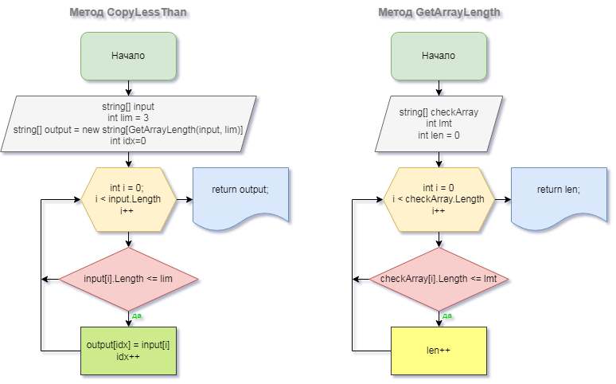

# Итоговая проверочная работа первого блока обучения

## Задача:
Написать программу, которая из имеющегося массива строк формирует новый массив из строк, длина которых меньше, либо равна 3 символам. 

Первоначальный массив можно ввести с клавиатуры, либо задать на старте выполнения алгоритма. 

При решении не рекомендуется пользоваться коллекциями, лучше обойтись исключительно массивами.

**Примеры:**
* *["hello", "2", "world", ":-)"]* -> ***["2", ":-)"]***
* *["1234", "1567", "-2", "computer science"]* -> ***["-2"]***
* *["Russia", "Denmark", "Kazan"]* -> ***[]***

## Алгоритм решения:

1. Создаем массив *userArray* с произвольным количеством элементов (запрашиваем у пользователя с помощью метода *AskArray*).
2. Создаем новый массив *result*, куда будем копировать те элементы пользовательского массива, которые удовлетворяют условию задачи.
3. Получаем длину нового массива, подсчитывая количество элементов пользовательского, удовлетворяющих условию (с помощью метода *GetArrayLength*).
4. Заполняем новый массив (с помощью метода *LessThanCopy*):
   1. перебираем элементы массива, проверяя на соответствие условию: длина элемента массива меньше или равна 3 символам;
   2. если условие выполнено, записываем значение в новый массив и обновляем его счетчик;
   3. повторяем шаги 4.1. - 4.2., пока не достигнем конца пользовательского массива;
   4. возвращаем новый заполненный массив.
5. Печатаем пользовательский массив *userArray* и новой строкой - являющийся решением задачи массив *result*.

## Блок-схема алгоритма:

